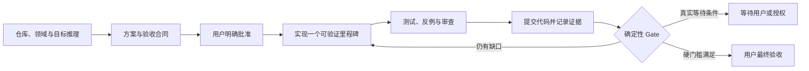

# Goal Flow

Goal Flow 是一个轻量、Codex 原生的长任务软件工程插件。它把“完成”从 Agent 的主观判断，改成由已批准验收标准、Git 状态、可复现检查和残余风险共同决定的确定性 Gate。

它只有四个核心部件：

- 一个用户可调用的 `$goal-flow` Skill；
- 一个无第三方依赖的 `goalctl.py` 状态与检查执行控制器；
- `SessionStart` 与 `Stop` 两个 Codex Hooks；
- 每个目标三份审计文件：`goal.md`、`state.json`、`evidence.md`。

## 设计边界

Goal Flow v0.2 聚焦单个 Codex、单个 Git 仓库、单个活动目标。方案阶段先由 Codex 基于证据补全目标，再用结构化验收标准和八类质量维度建立批准合同；实施与 Gate 始终追溯到该合同。它不会引入外部 Runner、MCP 服务、Agent 编排框架或复杂事件系统，也不会承诺虚假的“100% 正确”。在没有历史校准数据前，概率置信度固定显示为 `UNCALIBRATED`。

## 快速开始

1. 运行 `./install.sh`，再按[安装说明](docs/installation.md)信任 Hooks。
2. 在目标 Git 仓库中新建 Codex 任务。
3. 输入：`使用 $goal-flow 完成 <你的长任务>`。
4. 与 Codex 完善 `goal.md`，明确回复批准方案。
5. Codex 会自主执行里程碑；只有方案变化、权限/外部输入阻塞和最终验收需要你介入。

完整操作和恢复方式见[使用说明](docs/usage.md)，可靠性模型见[设计说明](docs/design.md)。

## 项目状态

当前版本是 `0.2.0`。它不是生产级形式化验证器；外部系统真实性、验收标准本身是否正确以及用户授权仍属于信任边界。
