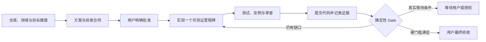

# Goal Flow

Goal Flow 是一个轻量、Codex 原生的任务 Harness 插件。它默认先为任务建立合适深度的计划，再按复杂度升级到完整的长任务闭环；“完成”由已批准验收标准、Git 状态、可复现检查和残余风险共同决定。

它只有四个核心部件：

- 一个用户可调用的 `$goal-flow` Skill；
- 一个无第三方依赖的 `goalctl.py` 状态与检查执行控制器；
- `SessionStart` 与 `Stop` 两个 Codex Hooks；
- 每个目标四份简单文件：`goal.md`、`state.json`、`evidence.md`、`events.jsonl`。

## 设计边界

Goal Flow v0.6 聚焦单个 Codex、单个 Git 仓库、单个活动目标。任务先按规模、风险和验证难度选择 `micro`、`standard` 或完整 `goal-flow` Harness；失败检查会给出分类和下一策略，项目级 `.goal-flow/context.md` 用于低成本恢复上下文。行为变化目标可生成 OpenSpec 风格的 `delta.md`、`tasks.md` 和 Given/When/Then 场景，并通过 `goalctl review` 做需求、任务、场景和证据追踪。它不会引入全局规格库、外部 Runner、数据库、Web UI 或复杂事件系统。

批准后用 `bind-worktree` 把目标绑定到规范化仓库、Git 目录和分支；文件锁与 revision CAS 防止并发写丢失。v0.5 继承 v0.4 的 MCP 审批服务，在完整 Harness 的方案和最终交付节点通过标准 elicitation 生成可点击控件，并保留无控件环境下的自然语言降级。验证超时会清理整个进程组，并记录不含环境变量值的运行环境指纹。

## 快速开始

1. 运行 `./install.sh`，再按[安装说明](docs/installation.md)信任 Hooks。
2. 在目标 Git 仓库中新建 Codex 任务。
3. 输入：`使用 $goal-flow 完成 <你的长任务>`。
4. 与 Codex 完善 `goal.md`，明确回复批准方案。
5. Codex 会先展示决策检查，再自主执行里程碑；只有高影响未决项、方案变化、权限/外部输入阻塞和最终验收需要你介入。提交说明默认使用当前对话语言。

完整操作和恢复方式见[使用说明](docs/usage.md)，可靠性模型见[设计说明](docs/design.md)。

## 项目状态

当前版本是 `0.6.0`。它不是生产级形式化验证器；外部系统真实性、验收标准本身是否正确以及用户授权仍属于信任边界。
