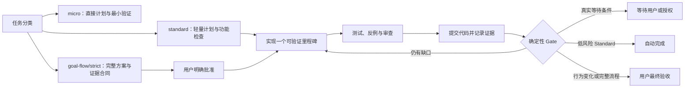

# Goal Flow

Goal Flow 是一个轻量、Codex 原生的任务 Harness 插件。它默认先为任务建立合适深度的计划，再按复杂度升级到完整的长任务闭环；“完成”由已批准验收标准、Git 状态、可复现检查和残余风险共同决定。

它只有四个核心部件：

- 一个用户可调用的 `$goal-flow` Skill；
- 一个无第三方依赖的 `goalctl.py` 状态与检查执行控制器；
- `SessionStart` 与 `Stop` 两个 Codex Hooks；
- 完整目标的四份核心文件：`goal.md`、`state.json`、`evidence.md`、`events.jsonl`；行为变化目标才额外生成 `delta.md` 和 `tasks.md`。

## 设计边界

Goal Flow v0.9 聚焦单个 Codex、单个 Git 仓库和一个明确的活动目标。`micro` 不初始化控制器，`standard` 使用真正的轻量计划，可保留初始化前的工作树基线；完整 `goal-flow` 或 `strict` 才启用显式审批、强制隔离和完整审计。失败检查会给出分类和下一策略，项目级 `.goal-flow/context.md` 按需启用以降低重复扫描成本。行为变化目标可生成 OpenSpec 风格的 `delta.md`、`tasks.md` 和 Given/When/Then 场景，并通过 `goalctl review` 做需求、任务、场景和证据追踪。

批准后，完整 Goal Flow/strict 自动使用 `codex/goal-flow-*` 隔离分支或独立 worktree；文件锁与 revision CAS 防止并发写丢失。v0.9 在所有需要显式审批的方案/交付节点通过带 `state_revision` 的 elicitation 生成可点击控件；拒绝交付会使旧回执失效，必须重新验证。低风险、非行为变化的 Standard 任务可隐式批准并自动完成，行为变化或中风险任务保留一次轻量交付确认。新建或恢复目标不会静默覆盖活动目标，必须显式使用 `--switch`。

## 快速开始

1. 运行 `./install.sh`，再按[安装说明](docs/installation.md)信任 Hooks。
2. 在目标 Git 仓库中新建 Codex 任务。
3. 输入：`使用 $goal-flow 完成 <你的长任务>`。
4. 与 Codex 完善 `goal.md`；普通 Standard 无高影响问题时自动继续，完整 Goal Flow 才需要明确批准方案。
5. Codex 会先展示决策检查，再自主执行里程碑；只有高影响未决项、方案变化、权限/外部输入阻塞和最终验收需要你介入。提交说明默认使用当前对话语言。

完整操作和恢复方式见[使用说明](docs/usage.md)，可靠性模型见[设计说明](docs/design.md)。

## 项目状态

当前版本是 `0.9.0`。它不是生产级形式化验证器；外部系统真实性、验收标准本身是否正确以及用户授权仍属于信任边界。
